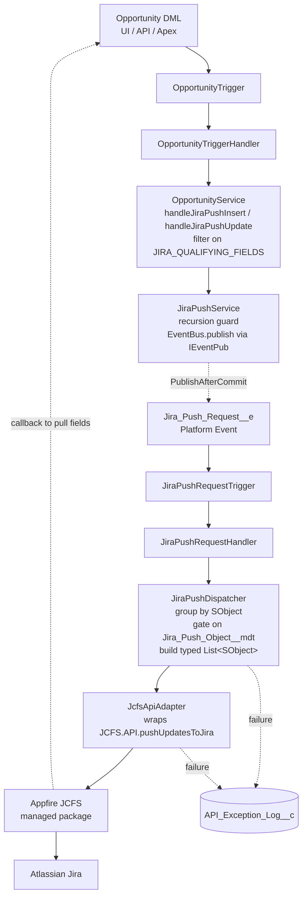

# CSI-7162 — Jira Push on Opportunity Change

> **Note:** This page is the design-time technical reference. For day-2 operations, see the [Operations Runbook](../operations/csi7162-jira-push-runbook.md). For go-live procedure, see the [Production Go-Live Runbook](../runbooks/csi-7162-go-live.md). The user-story ticket lives at [docs/jira/csi-7162-user-story.md](../jira/csi-7162-user-story.md).

## Overview

### What

Salesforce publishes a `Jira_Push_Request__e` platform event whenever an Opportunity is inserted, or updated with a change to one of six qualifying fields. An Apex Platform Event trigger consumes the event and invokes the Appfire JCFS managed package, which forwards the Opportunity Id to Jira. Jira then calls back into Salesforce to pull the fields its own mapping requires.

### Why

Sales updates an Opportunity in Salesforce; the implementation team's Jira issue tracking that deal goes stale until somebody manually reconciles. CSI-7162 closes that gap without coupling the Opportunity save transaction to Jira availability — the originating DML commits whether or not Jira is reachable. Per-record failure visibility is preserved through `API_Exception_Log__c`, so support can identify exactly which records did not propagate.

### Design tenets

| Tenet                              | Realization                                                                                                                                                                                                 |
| ---------------------------------- | ----------------------------------------------------------------------------------------------------------------------------------------------------------------------------------------------------------- |
| **Fire-and-forget**                | `Jira_Push_Request__e` is `PublishAfterCommit`. If the originating DML rolls back, no event is delivered. Jira availability never blocks Salesforce.                                                        |
| **SObject-agnostic publisher**     | `JiraPushService` knows nothing about Opportunity, qualifying fields, or domain rules. Adding `Case` (or any other SObject) means adding a domain service + handler + trigger — not changing the publisher. |
| **Compile-time-typed field set**   | `JIRA_QUALIFYING_FIELDS` uses `Schema.SObjectField` tokens, not String names. Field rename = compile error, not silent runtime mismatch.                                                                    |
| **Per-record failure attribution** | `IJcfsApi.pushUpdates` returns `List<JcfsPushResult>` — one DTO per record. A single bad record in a batch of 200 produces one log row; the other 199 still ship.                                           |
| **Defense-in-depth kill switch**   | CMDT `Active__c` is consulted on both publish and consume sides. Flipping the flag stops events at the bus entry, not just at JCFS dispatch.                                                                |

## Architecture

### Flow diagram



### Three-layer pattern

| Layer                     | Class                                                                                                                                                                                   | Responsibility                                                                               |
| ------------------------- | --------------------------------------------------------------------------------------------------------------------------------------------------------------------------------------- | -------------------------------------------------------------------------------------------- |
| **Trigger**               | [OpportunityTrigger](../../force-app/main/default/triggers/OpportunityTrigger.trigger), [OpportunityTriggerHandler](../../force-app/main/default/classes/OpportunityTriggerHandler.cls) | Bare dispatcher. No business logic.                                                          |
| **Domain service**        | [OpportunityService](../../force-app/main/default/classes/OpportunityService.cls)                                                                                                       | Opportunity-specific decisions: what qualifies, what to do on insert vs. update.             |
| **Generic service**       | [JiraPushService](../../force-app/main/default/classes/JiraPushService.cls)                                                                                                             | SObject-agnostic publisher. Recursion guard. Reads CMDT.                                     |
| **Integration / adapter** | [JiraPushDispatcher](../../force-app/main/default/classes/JiraPushDispatcher.cls), [JcfsApiAdapter](../../force-app/main/default/classes/JcfsApiAdapter.cls)                            | Consumes PE; gates on CMDT; builds JCFS-compatible typed list.                               |
| **Selector**              | _(deliberately absent)_                                                                                                                                                                 | JCFS pulls field values back from Jira. The Salesforce side never queries the source record. |

> **Note:** The absence of a Selector layer is intentional. Adding one would mean Salesforce computes the payload — which couples the integration to a specific field set and creates a Salesforce-side maintenance burden every time Jira's mapping changes. JCFS's pull-back model owns that surface.

## Data model

### Platform event: `Jira_Push_Request__e`

`HighVolume`, `PublishAfterCommit`. The event carries no field payload beyond what JCFS needs to identify the source record.

| Field                | Type     | Purpose                                                                                                               |
| -------------------- | -------- | --------------------------------------------------------------------------------------------------------------------- |
| `Source_Object__c`   | Text(80) | API name of the source SObject. Currently `Opportunity` (`Case` reserved).                                            |
| `Source_Id__c`       | Text(18) | Id of the source record.                                                                                              |
| `Change_Type__c`     | Picklist | `Create` or `Update`. Part of the recursion-guard key.                                                                |
| `Event_Timestamp__c` | DateTime | When the publishing trigger fired.                                                                                    |
| `Transaction_Id__c`  | Text(80) | `System.Request.getCurrent().getRequestId()`. Lets support trace a publish back to a specific Salesforce transaction. |

Object meta: [`Jira_Push_Request__e.object-meta.xml`](../../force-app/main/default/objects/Jira_Push_Request__e/Jira_Push_Request__e.object-meta.xml).

### Custom object: `API_Exception_Log__c`

Persistent error log. One row per failed PE publish, JCFS rejection, or JCFS exception. Auto-numbered `AEL-{00000}`. Private sharing. Insert runs under `AccessLevel.SYSTEM_MODE` (see [ADR-0002](../../.claude/worktrees/feature-engagement-attribution/docs/architecture/decisions/0002-logger-system-mode-for-api-exceptions.md)).

| Field                                               | Purpose                                                                   |
| --------------------------------------------------- | ------------------------------------------------------------------------- |
| `API_Name__c`                                       | `'JCFS'` for CSI-7162                                                     |
| `Operation__c`                                      | Pipeline step that failed (`pushOne`, `JCFS.API.pushUpdatesToJira`, etc.) |
| `Source_Object__c` / `Source_Record_Id__c`          | What was being pushed                                                     |
| `Transaction_Id__c`                                 | Originating Salesforce transaction                                        |
| `Exception_Type__c`, `Message__c`, `Stack_Trace__c` | Diagnostics                                                               |
| `Do_Not_Delete__c`                                  | Retention flag                                                            |

Object meta: [`API_Exception_Log__c.object-meta.xml`](../../force-app/main/default/objects/API_Exception_Log__c/API_Exception_Log__c.object-meta.xml).

### Custom metadata: `Jira_Push_Object__mdt`

Per-SObject configuration. Object meta: [`Jira_Push_Object__mdt.object-meta.xml`](../../force-app/main/default/objects/Jira_Push_Object__mdt/Jira_Push_Object__mdt.object-meta.xml).

| Field                 | Default for Opportunity | Purpose                                                   |
| --------------------- | ----------------------- | --------------------------------------------------------- |
| `SObject_API_Name__c` | `Opportunity`           | Which SObject to enable                                   |
| `Active__c`           | `true`                  | Kill switch. Gated on **both** publish and consume sides. |
| `Jira_Project_Id__c`  | `CSI`                   | Jira project key                                          |
| `Jira_Issue_Type__c`  | `Story`                 | Jira issue type for auto-create flows                     |

Ship records: [`Jira_Push_Object.Opportunity.md-meta.xml`](../../force-app/main/default/customMetadata/Jira_Push_Object.Opportunity.md-meta.xml), [`Jira_Push_Object.Case.md-meta.xml`](../../force-app/main/default/customMetadata/Jira_Push_Object.Case.md-meta.xml) (ships disabled).

### Qualifying field set

Hardcoded in `OpportunityService` as `Schema.SObjectField` tokens (not String names):

```apex
private static final Set<Schema.SObjectField> JIRA_QUALIFYING_FIELDS = new Set<Schema.SObjectField>{
    Opportunity.StageName,
    Opportunity.Amount,
    Opportunity.CloseDate,
    Opportunity.AccountId,
    Opportunity.OwnerId,
    Opportunity.Probability
};
```

> **Note:** Adding a field here costs one platform event per qualifying record per transaction. Additions are deliberate.

## Integration points

### Appfire JCFS managed package

**Required for production.** The Salesforce side does **not** maintain a Named Credential for Jira — JCFS owns the auth.

| Concern                                         | Owner                                                       |
| ----------------------------------------------- | ----------------------------------------------------------- |
| Jira authentication (OAuth / API token)         | JCFS package config                                         |
| Field-level mapping (what Jira pulls from SFDC) | JCFS / Jira admin                                           |
| Per-record push call                            | CSI-7162's `JcfsApiAdapter` -> `JCFS.API.pushUpdatesToJira` |
| Callback into Salesforce to pull field values   | JCFS package                                                |

**Absence detection:** `JcfsApiAdapter` runs a one-time `Type.forName('JCFS', 'API')` probe per transaction. If the type is null, it emits `Logger.error('JCFS managed package is not installed - Jira push integration is silently no-op''d. Install the Appfire JCFS package to enable.')` once and returns failure `JcfsPushResult`s for every record. Every record gets an `API_Exception_Log__c` row — the "Jira not actually called" state is visible in support reports rather than silent.

### Platform events

Single PE: `Jira_Push_Request__e`. `HighVolume`, `PublishAfterCommit`. No callouts, no chunking — the PE is the async boundary. Subscription is Apex-only (`JiraPushRequestTrigger`).

### No outbound callouts

CSI-7162 makes zero outbound HTTP calls. JCFS owns all wire-level Jira communication. Named Credentials, remote site settings, and connected app configuration are JCFS concerns.

## Configuration

### CMDT records (ship with the package)

| DeveloperName | `Active__c` | Notes                                                                                       |
| ------------- | ----------- | ------------------------------------------------------------------------------------------- |
| `Opportunity` | `true`      | Production-ready                                                                            |
| `Case`        | `false`     | Reserved for follow-on story; flip to enable once `CaseService` + `CaseTriggerHandler` ship |

### Permsets

| Permset                       | Grants                                                                        | Assign to                                                                               |
| ----------------------------- | ----------------------------------------------------------------------------- | --------------------------------------------------------------------------------------- |
| `CSI_7162_Integration_Admin`  | Read on `API_Exception_Log__c`; admin app access                              | Integration admins, support engineers                                                   |
| `CSI_7162_System_Integration` | Insert/Update on `API_Exception_Log__c`; PE publish on `Jira_Push_Request__e` | (Auto — granted to Automated Process User context via PE trigger; verify in target org) |

> **Note:** The Automated Process User runs the PE trigger. Verify it can see the JCFS namespace — if the JCFS package has its own permset, assign it to the Automated Process User.

### Profile assignments

None required beyond the permsets above. Standard `Salesforce` user license covers all CSI-7162 functionality on the sales side; integration admins typically have `Salesforce` or `System Administrator`.

## Operational concerns

### Logs

| What                              | Where                      | Volume                         |
| --------------------------------- | -------------------------- | ------------------------------ | ----------- | ---------------------------------------------------------- | -------------------------------------- |
| Successful publish                | Apex debug log — `INFO     | JiraPushService                | publish     | Publishing 1 Jira push event(s) for Opportunity (txn xxx)` | One per qualifying DML transaction     |
| Successful JCFS push (per record) | Apex debug log — `INFO     | JiraPushDispatcher             | pushOne     | JCFS push success for Opportunity 006xxx -> CSI-1234`      | One per record pushed                  |
| Inactive CMDT                     | Apex debug log — `INFO     | JiraPushService                | publish     | Jira push inactive for Opportunity; skipping publish`      | One per skipped publish                |
| JCFS-absent (one-time)            | Apex debug log — `ERROR    | JcfsApiAdapter                 | pushUpdates | JCFS managed package is not installed...`                  | Once per transaction when JCFS missing |
| PE publish failure                | `API_Exception_Log__c` row | Rare                           |
| JCFS per-record rejection         | `API_Exception_Log__c` row | Per failed record              |
| JCFS whole-batch exception        | `API_Exception_Log__c` row | Rare (Jira down, auth expired) |

### Error handling

Three layers of failure handling, all fire-and-forget:

1. **`PublishAfterCommit` semantics** — if the originating DML rolls back, no PE is delivered. Salesforce save is never blocked by Jira.
2. **PE publish failure** (per-event `SaveResult.isSuccess() == false`) — logged via `Logger.logApiException`; originating transaction is not impacted.
3. **JCFS layer** — per-record `JcfsPushResult.success = false` and whole-batch JCFS exceptions both routed through `Logger.logApiException` -> `API_Exception_Log__c`. Exceptions never propagate out of `JiraPushDispatcher.pushOne`.

> **Note:** There is **no automatic retry**. A failed push is recorded in `API_Exception_Log__c` and requires manual replay. See the [runbook](../runbooks/csi-7162-go-live.md#replay-a-dropped-push).

### Rollback

| Scope                                  | Procedure                                                                                                                                                                                   |
| -------------------------------------- | ------------------------------------------------------------------------------------------------------------------------------------------------------------------------------------------- |
| **Pause one SObject**                  | Set `Jira_Push_Object.<SObject>.Active__c = false` in CMDT. Takes effect next transaction. No deploy.                                                                                       |
| **Pause all of CSI-7162**              | Set `Jira_Push_Object.Opportunity.Active__c = false`. (Only `Opportunity` is enabled in v1.)                                                                                                |
| **Pause Opportunity trigger entirely** | Use `TriggerHandler` framework bypass. Heavy hammer — disables every Opportunity trigger handler.                                                                                           |
| **Hard rollback**                      | Remove `JcfsApiAdapter.cls` from the deploy or add to `.forceignore`. Dispatcher falls back to `NoOpJcfsApi` — pipeline runs but no JCFS call. Useful for staging without the JCFS package. |
| **Full uninstall**                     | Destructive change. Remove triggers + classes + PE + CMDT in dependency order. See [runbook §Rollback](../runbooks/csi-7162-go-live.md#rollback-procedure).                                 |

## Test coverage

| Class                       | Test class                      | Notes                                                                                                                     |
| --------------------------- | ------------------------------- | ------------------------------------------------------------------------------------------------------------------------- |
| `OpportunityService`        | `OpportunityServiceTest`        | Qualifying-field matrix; insert vs. update routing                                                                        |
| `OpportunityTriggerHandler` | `OpportunityTriggerHandlerTest` | Phase routing, bypass                                                                                                     |
| `JiraPushService`           | `JiraPushServiceTest`           | Recursion guard, CMDT active gate (both sides), PE publish, change-type keying                                            |
| `JiraPushRequestHandler`    | `JiraPushRequestHandlerTest`    | PE delivery dispatch                                                                                                      |
| `JiraPushDispatcher`        | `JiraPushDispatcherTest`        | SObject grouping, typed-list construction, per-record `JcfsPushResult` success + failure, no-op fallback when JCFS absent |
| `JcfsApiAdapter`            | `JcfsApiAdapterTest`            | Startup probe; one-time error log; per-record failure result emission                                                     |

Shared fixtures: `JiraPushTestFixtures`. Test mode uses `JiraPushService.configCacheOverride` to inject CMDT state without a deploy.

Coverage: 100% for the CSI-7162 classes. Atlas's [code review](../reviews/atlas-csi7162-code-review-2026-05-12.md) and Pippa's [test review](../reviews/pippa-csi7162-test-review-2026-05-12.md) cover the test design.

## Known limitations / open items

- **No automatic retry.** Manual replay only. Acceptable because JCFS retries some failure modes itself; full retry-with-backoff is a v2 candidate if log volume warrants.
- **Case is shipped but not wired.** The CMDT row exists with `Active__c = false`. Enabling Case requires a `CaseService` and `CaseTriggerHandler` modeled on the Opportunity pair. Tracked separately.
- **Cross-transaction idempotency is Jira's problem.** The recursion guard is transaction-scoped. Re-saving the same Opportunity in two separate transactions produces two PE events. JCFS / Jira mapping reconciles repeat pushes.
- **CMDT cache is per-transaction.** Flipping `Active__c` is honored on the next transaction — an in-flight transaction will still operate on the cached value.
- **JCFS auth is opaque from this side.** If JCFS auth expires, every record in a batch fails identically. Detection is via the `JCFS.API.pushUpdatesToJira` whole-batch `API_Exception_Log__c` row, not via a callback from Jira.
- **`Jira_Project_Id__c` and `Jira_Issue_Type__c` are read but not currently sent.** They're surfaced for JCFS's `pushTopicToJira` auto-create flow, which is a JCFS-side capability. Today, these fields are documentation-only — the value lives in CMDT so the JCFS admin can see what each SObject maps to without checking Jira.

## References

- [CSI-7162 user story](../jira/csi-7162-user-story.md)
- [CSI-7162 production go-live runbook](../runbooks/csi-7162-go-live.md)
- [CSI-7162 operations runbook](../operations/csi7162-jira-push-runbook.md)
- [Architecture overview (long form)](../architecture/csi7162-jira-push-overview.md)
- [Admin guide](../users/csi7162-jira-push-admin-guide.md)
- [ADR-0002 — Logger system-mode for API exceptions](../../.claude/worktrees/feature-engagement-attribution/docs/architecture/decisions/0002-logger-system-mode-for-api-exceptions.md)
- [Atlas code review](../reviews/atlas-csi7162-code-review-2026-05-12.md)
- [Pippa test review](../reviews/pippa-csi7162-test-review-2026-05-12.md)
- [Sage security pass-through](../reviews/sage-csi7162-security-passthrough-2026-05-12.md)
- [Original Jira ticket export — CSI-7162.xml](../../CSI-7162.xml)
