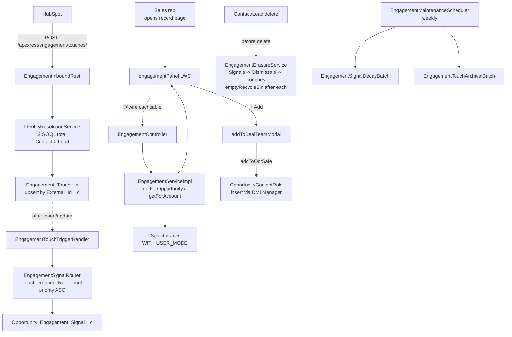
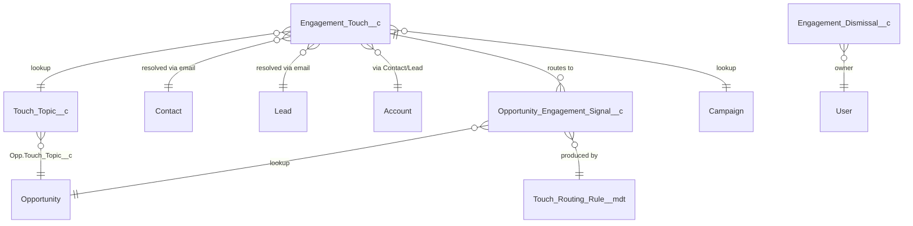

# Marketing Influence (MI) — Engagement Attribution

> **Note:** "Marketing Influence" is the customer-facing / stakeholder name. "Engagement Attribution" is the internal code-base name. They refer to the same feature. New code and SObject API names use `Engagement_*`; user-facing UI and decks use "Marketing Influence."

> **Note:** This page is the design-time technical reference. For go-live, see the [Production Go-Live Runbook](../runbooks/mi-go-live.md). For the user-story ticket, see [docs/jira/mi-user-story.md](../jira/mi-user-story.md). For demo flow and admin guidance, see the [worktree DEMO.md](../../.claude/worktrees/feature-engagement-attribution/docs/users/DEMO.md).

## Overview

### What

Marketing Influence captures every HubSpot marketing-engagement event as an event-level `Engagement_Touch__c` record in Salesforce. It resolves each touch to a Contact / Lead / Account by email, then routes the touch into per-Opportunity `Opportunity_Engagement_Signal__c` records via priority-ordered custom-metadata rules. The result is surfaced as a compact right-rail panel on Account and Opportunity record pages, with one-click "+ Add to Deal Team" actions. The structural problem MI solves: `OpportunityContactRole` is sales-curated and incomplete — high-intent engagement from CFOs, evaluators, consultants, and partners doesn't reach attribution today because those people aren't on OCR. MI attributes via topic + account context (not via OCR), then makes maintaining OCR a value-add for sales rather than overhead.

### Why

Today, Campaign Influence reports against OCR membership. If a CFO downloads three pricing whitepapers but isn't on OCR, marketing gets no attribution credit and sales never sees the signal. MI closes both gaps simultaneously by:

1. **Capturing event-level data** — every engagement is a record, not a roll-up. Foundation for future AI / next-best-action work.
2. **Attributing without OCR dependence** — topic + account match instead of OCR membership.
3. **Surfacing engagement to sales** — the right-rail panel turns marketing data into a sales workflow.
4. **Preserving Campaign Influence unchanged** — MI augments; it doesn't replace.

### Design tenets

| Tenet                             | Realization                                                                                                                                                                                                                                                                                    |
| --------------------------------- | ---------------------------------------------------------------------------------------------------------------------------------------------------------------------------------------------------------------------------------------------------------------------------------------------- |
| **Three-layer pattern**           | Selector / Service / Domain. SOQL only in Selectors. Business rules only in Services. DML through `DMLManager` under `AccessLevel.USER_MODE`. ([ADR-0001](../../.claude/worktrees/feature-engagement-attribution/docs/architecture/decisions/0001-three-layer-selector-service-controller.md)) |
| **Bulk-safe identity resolution** | `IdentityResolutionService` runs exactly 2 SOQL (Contact + Lead) regardless of batch size — never per-record queries.                                                                                                                                                                          |
| **Externalized routing rules**    | `Touch_Routing_Rule__mdt` is admin-managed. Adding a rule, raising a priority, or changing a match path is a CMDT edit, not an Apex deploy.                                                                                                                                                    |
| **Idempotent ingestion**          | `Engagement_Touch__c` is upserted by `External_Id__c`. HubSpot retries are safe.                                                                                                                                                                                                               |
| **Hard-delete erasure cascade**   | CCPA/HIPAA delete-my-data hard-deletes children in order (Signals -> Dismissals -> Touches) and empties the recycle bin. `SELECT ... ALL ROWS` returns zero.                                                                                                                                   |
| **Per-user dismissal**            | `Engagement_Dismissal__c` is per-user — your hidden row stays visible to your colleagues.                                                                                                                                                                                                      |
| **Lead-conversion-aware**         | `LeadEngagementReparentHandler` repoints `Lead__c` touches to `ConvertedContactId` / `ConvertedAccountId` on conversion.                                                                                                                                                                       |

## Architecture

### Flow diagram

### Three-layer pattern

| Layer        | Examples                                                                                                                                                                                                                                                                                                                                                                                                                                                                                                                                                                                                                                                                                                                                                                                                            | Responsibility                                                                                                                                                              |
| ------------ | ------------------------------------------------------------------------------------------------------------------------------------------------------------------------------------------------------------------------------------------------------------------------------------------------------------------------------------------------------------------------------------------------------------------------------------------------------------------------------------------------------------------------------------------------------------------------------------------------------------------------------------------------------------------------------------------------------------------------------------------------------------------------------------------------------------------- | --------------------------------------------------------------------------------------------------------------------------------------------------------------------------- |
| **Selector** | [EngagementTouchesSelector](../../.claude/worktrees/feature-engagement-attribution/force-app/main/default/classes/engagement/EngagementTouchesSelector.cls), [OpportunityContactRolesSelector](../../.claude/worktrees/feature-engagement-attribution/force-app/main/default/classes/engagement/OpportunityContactRolesSelector.cls), [TouchTopicSelector](../../.claude/worktrees/feature-engagement-attribution/force-app/main/default/classes/engagement/TouchTopicSelector.cls), [TouchRoutingRulesSelector](../../.claude/worktrees/feature-engagement-attribution/force-app/main/default/classes/engagement/TouchRoutingRulesSelector.cls), [EngagementDismissalsSelector](../../.claude/worktrees/feature-engagement-attribution/force-app/main/default/classes/engagement/EngagementDismissalsSelector.cls) | All SOQL. `WITH USER_MODE` on every query. No DML, no business rules.                                                                                                       |
| **Service**  | [EngagementServiceImpl](../../.claude/worktrees/feature-engagement-attribution/force-app/main/default/classes/engagement/EngagementServiceImpl.cls), [EngagementSignalRouter](../../.claude/worktrees/feature-engagement-attribution/force-app/main/default/classes/engagement/EngagementSignalRouter.cls), [IdentityResolutionService](../../.claude/worktrees/feature-engagement-attribution/force-app/main/default/classes/engagement/IdentityResolutionService.cls), [EngagementErasureService](../../.claude/worktrees/feature-engagement-attribution/force-app/main/default/classes/engagement/EngagementErasureService.cls)                                                                                                                                                                                  | Business rules. Orchestrates Selectors. DML via `DMLManager` under `AccessLevel.USER_MODE`. Throws `EngagementException`. Logs via `Logger`.                                |
| **Domain**   | [EngagementTouches](../../.claude/worktrees/feature-engagement-attribution/force-app/main/default/classes/engagement/EngagementTouches.cls)                                                                                                                                                                                                                                                                                                                                                                                                                                                                                                                                                                                                                                                                         | In-memory shaping. Wraps `List<Engagement_Touch__c>`. No DML/SOQL. Skeleton in v1; earns more responsibility as aggregation logic moves out of the Service in later phases. |
| **Surface**  | [EngagementController](../../.claude/worktrees/feature-engagement-attribution/force-app/main/default/classes/engagement/EngagementController.cls), [EngagementInboundRest](../../.claude/worktrees/feature-engagement-attribution/force-app/main/default/classes/engagement/EngagementInboundRest.cls), trigger handlers, batches                                                                                                                                                                                                                                                                                                                                                                                                                                                                                   | Thin. One Service call per method.                                                                                                                                          |

## Data model

### Custom objects

| Object                             | Purpose                                  | Key fields                                                                                                                                                                                                                                          |
| ---------------------------------- | ---------------------------------------- | --------------------------------------------------------------------------------------------------------------------------------------------------------------------------------------------------------------------------------------------------- |
| `Engagement_Touch__c`              | One row per marketing event from HubSpot | `External_Id__c` (unique, idempotency key), `Email__c`, `Occurred_At__c`, `Touch_Topic__c` (lookup), `Touch_Type__c`, `Resolution_Status__c`, `Contact__c`, `Lead__c`, `Account__c`, `Campaign__c`, `Intent_Level__c`, `Raw_Payload__c` (Long Text) |
| `Opportunity_Engagement_Signal__c` | One row per (touch, opp, match-path)     | `Engagement_Touch__c` (lookup), `Opportunity__c` (lookup), `Match_Path__c` (OCR \| ACR \| Account \| Domain \| Consultant), `Confidence__c`, `Routing_Rule__c` (lookup to CMDT row), `Last_Decayed_At__c`                                           |
| `Engagement_Dismissal__c`          | Per-user "hide this row"                 | `User__c`, `Engagement_Touch__c` \| `Contact__c` \| `Lead__c`, `Scope__c` (Opportunity \| Account)                                                                                                                                                  |
| `Touch_Topic__c`                   | Topic dimension                          | `External_Code__c` (lookup key from HubSpot), `Name`, `Description__c`, `Active__c`                                                                                                                                                                 |

### Custom metadata type: `Touch_Routing_Rule__mdt`

The routing rule set is fully admin-managed. Five rules ship by default — see [DEMO.md §Seeded routing rules](../../.claude/worktrees/feature-engagement-attribution/docs/users/DEMO.md). Rules execute in `Priority__c` ASC order; the first matching rule produces the signal.

| Field                     | Purpose                                                |
| ------------------------- | ------------------------------------------------------ |
| `Priority__c`             | Evaluation order (lower = earlier)                     |
| `Active__c`               | Per-rule kill switch                                   |
| `Match_Path__c`           | One of `OCR`, `ACR`, `Account`, `Domain`, `Consultant` |
| `Require_Same_Account__c` | Constrain to same Account                              |
| `Require_Topic_Match__c`  | Constrain to Opp's `Touch_Topic__c`                    |
| `Persona_Filter__c`       | Persona-level filter                                   |
| `Touch_Type_Filter__c`    | Touch-type filter                                      |
| `Min_Intent_Level__c`     | Confidence floor                                       |
| `Default_Confidence__c`   | Signal confidence at creation                          |

### Custom setting: `Engagement_Settings__c`

Hierarchy. Org Default record drives the maintenance batch tunables.

| Field                     | Default | Effect                                                                    |
| ------------------------- | ------: | ------------------------------------------------------------------------- |
| `Active_Window_Days__c`   |     180 | Touches older than this get archived                                      |
| `Signal_Decay_Days__c`    |      90 | Age at which a signal's `Confidence__c` floors at zero                    |
| `Confidence_Threshold__c` |      40 | Reserved for the UI panel's "show only high-confidence" filter (Phase 4A) |

### Schema relationships

## Integration points

### Inbound REST endpoint

| Concern          | Value                                                                                                                                               |
| ---------------- | --------------------------------------------------------------------------------------------------------------------------------------------------- |
| URL              | `https://<org>.my.salesforce.com/services/apexrest/engagement/touches/`                                                                             |
| Method           | `POST`                                                                                                                                              |
| Auth             | Bearer (Salesforce session for the Integration User)                                                                                                |
| Content-Type     | `application/json`                                                                                                                                  |
| Class            | [EngagementInboundRest](../../.claude/worktrees/feature-engagement-attribution/force-app/main/default/classes/engagement/EngagementInboundRest.cls) |
| Request envelope | `{events:[{external_id, email, occurred_at, topic_external_code, touch_type, campaign_name, intent_level, raw_payload}]}`                           |
| Response         | `{success: true, processed: N, results: [{external_id, resolution_status}]}`                                                                        |

Auth model: HubSpot stores Salesforce session credentials for the Integration User (a dedicated, programmatic user). The Salesforce side does **not** maintain a Named Credential to HubSpot — MI is one-way ingest.

### No outbound HubSpot callouts

MI does not call HubSpot. There is no Named Credential for HubSpot. The Salesforce side is a sink, not a source. If two-way integration is needed in the future, that's a separate story.

### Platform events

None. The trigger is synchronous `after insert/update` on `Engagement_Touch__c`. We considered a PE-mediated routing step but determined the trigger fires comfortably under governor limits at expected ingestion rates (~5k touches/day initially, ~30k/day projected at 18 months). PE adoption is a forward-compatible v2 if volume warrants.

### Named credentials

| Name                    | Direction | Purpose                                                                                           |
| ----------------------- | --------- | ------------------------------------------------------------------------------------------------- |
| _(none required by MI)_ | —         | MI is inbound-only. JCFS owns Jira auth (separate from MI). HubSpot owns its own session to SFDC. |

## Configuration

### CMDT records — `Touch_Routing_Rule__mdt`

Five rules ship by default:

| DeveloperName           | Priority | Match Path | Topic Match | Confidence |
| ----------------------- | -------: | ---------- | :---------: | ---------: |
| `OCR_Direct`            |       10 | OCR        |  required   |        100 |
| `ACR_Direct`            |       20 | ACR        |  required   |         80 |
| `Domain_Match`          |       30 | Domain     |  required   |         70 |
| `Consultant_Influence`  |       40 | Consultant |  required   |         65 |
| `Account_Topic_Default` |       50 | Account    |  required   |         60 |

Edit via Setup -> Custom Metadata Types -> Touch Routing Rule -> Manage Records. Version-controlled via `customMetadata/Touch_Routing_Rule.<DeveloperName>.md-meta.xml`.

### Custom setting — `Engagement_Settings__c`

Edit via Setup -> Custom Settings -> Engagement Settings -> Manage -> Default Organization Level Value. No deploy required.

### Permsets

| Permset               | Grants                                                                                                                                               | Assign to                               |
| --------------------- | ---------------------------------------------------------------------------------------------------------------------------------------------------- | --------------------------------------- |
| `MI_Sales_User`       | Read on `Engagement_Touch__c`, `Opportunity_Engagement_Signal__c`, `Touch_Topic__c`; CRUD on `Engagement_Dismissal__c` (own records); LWC tab access | AEs, SDRs, sales engineers              |
| `MI_Marketing_Ops`    | Sales perms + Read on `Touch_Routing_Rule__mdt` (admin app); `EngagementAdminController` access                                                      | Marketing operations                    |
| `MI_Integration_User` | CRUD on `Engagement_Touch__c`, `Touch_Topic__c`, `Campaign`; ApexREST access to `EngagementInboundRest`                                              | Dedicated HubSpot integration user only |
| `MI_Admin`            | Full CRUD on all MI objects + CMDT manage; admin app; batch / scheduler access                                                                       | MI feature owner, support engineers     |

### Profile assignments

Standard `Salesforce` license covers AE/SDR usage. Integration user typically `Salesforce Platform` or `Salesforce` license — the licensing call is owned by the Salesforce admin.

### LWC placement

`engagementPanel` is added to Lightning App Builder pages for `Account` and `Opportunity`. Placement: right rail, below standard components, ~300px height when collapsed. Three pages ship:

- `Opportunity_Record_Page_MI` — Opportunity with MI panel
- `Account_Record_Page_MI` — Account with MI panel
- `MI_Admin_App` — admin app for routing rules

See [DEMO.md](../../.claude/worktrees/feature-engagement-attribution/docs/users/DEMO.md) for placement screenshots.

## Operational concerns

### Logs

| What                          | Where                                                                    | Volume                    |
| ----------------------------- | ------------------------------------------------------------------------ | ------------------------- | ---------------- | ------------------------------------------- | -------------------- |
| Inbound POST                  | Apex debug log — `INFO                                                   | EngagementInboundRest     | ingest           | Processed N touches; M resolved`            | One per POST         |
| Identity resolution           | `INFO                                                                    | IdentityResolutionService | resolveAll       | 2 SOQL; resolved N/M`                       | One per call         |
| Signal routing                | `INFO                                                                    | EngagementSignalRouter    | routeTouches     | 6 SOQL; produced N signals for M touches`   | One per trigger pass |
| Erasure cascade               | `INFO                                                                    | EngagementErasureService  | eraseForContacts | deleted N touches, M signals, P dismissals` | One per cascade      |
| Maintenance batches           | Standard `BatchableErrorRecovery` framework logs                         | One per batch execution   |
| Validation failures (inbound) | `400` response + Apex debug log                                          | Per malformed event       |
| Unhandled exceptions          | `Logger.error` -> `API_Exception_Log__c` (shared with CSI-7162 + others) | Rare                      |

### Error handling

1. **Inbound REST** — `400` for malformed envelope; `200` with per-event status for individual rejections. Never returns `500` for caller-recoverable issues.
2. **Identity resolution** — touches that don't resolve get `Resolution_Status__c = 'Pending'` and are retained. The maintenance scheduler re-attempts on the next pass (Phase 3 capability — currently the touches sit in `Pending` until the email matches a future Contact / Lead).
3. **Signal routing** — exceptions in the router catch up to `EngagementException` and are logged; the trigger context does not abort the touch upsert. The signal is then absent until manual re-routing.
4. **LWC** — `@AuraEnabled` errors surface via the standard Lightning error toast pattern; the panel itself renders with an empty state on Apex errors.

### Rollback

| Scope                        | Procedure                                                                                                                                                                                                                                      |
| ---------------------------- | ---------------------------------------------------------------------------------------------------------------------------------------------------------------------------------------------------------------------------------------------- |
| **Pause one routing rule**   | Set `Touch_Routing_Rule.<DeveloperName>.Active__c = false`. Next touch upsert respects the change. No deploy.                                                                                                                                  |
| **Pause all signal routing** | Disable the `EngagementTouchTrigger` via the `TriggerHandler` framework bypass. Touches still ingest; no new signals produced.                                                                                                                 |
| **Pause inbound REST**       | Remove the `MI_Integration_User` permset from the HubSpot integration user, OR remove the `RestResource` URL mapping from `EngagementInboundRest.cls` via a deploy. Heavy hammer.                                                              |
| **Hide LWC panel**           | Edit the Lightning App Builder pages to remove `engagementPanel`. Apex backend keeps running; UI is gone.                                                                                                                                      |
| **Full uninstall**           | Destructive change. Order: scheduler -> batches -> triggers -> LWC -> Apex classes -> CMDT records -> custom objects (Signals -> Dismissals -> Touches -> Touch_Topic). See [runbook §Rollback](../runbooks/mi-go-live.md#rollback-procedure). |

> **Note:** The hard-delete erasure cascade is irreversible by design. Do not soften without privacy-counsel sign-off.

## Test coverage

Every Apex class in `engagement/` has a paired `*Test` class. Per-class refs: [docs/development/classes/](../../.claude/worktrees/feature-engagement-attribution/docs/development/classes/).

| Class                             | Test class                            |
| --------------------------------- | ------------------------------------- |
| `EngagementInboundRest`           | `EngagementInboundRestTest`           |
| `IdentityResolutionService`       | `IdentityResolutionServiceTest`       |
| `EngagementSignalRouter`          | `EngagementSignalRouterTest`          |
| `EngagementServiceImpl`           | `EngagementServiceImplTest`           |
| `EngagementController`            | `EngagementControllerTest`            |
| `EngagementAdminController`       | `EngagementAdminControllerTest`       |
| `EngagementErasureService`        | `EngagementErasureServiceTest`        |
| `ContactEngagementErasureHandler` | `ContactEngagementErasureHandlerTest` |
| `LeadEngagementErasureHandler`    | `LeadEngagementErasureHandlerTest`    |
| `LeadEngagementReparentHandler`   | `LeadEngagementReparentHandlerTest`   |
| `EngagementSignalDecayBatch`      | `EngagementSignalDecayBatchTest`      |
| `EngagementTouchArchivalBatch`    | `EngagementTouchArchivalBatchTest`    |
| `EngagementMaintenanceScheduler`  | `EngagementMaintenanceSchedulerTest`  |
| `EngagementTouchTriggerHandler`   | `EngagementTouchTriggerHandlerTest`   |
| `EngagementTouches`               | `EngagementTouchesTest`               |
| Selectors (5)                     | Paired `*SelectorTest` classes        |

LWC Jest tests cover `engagementPanel`, `engagementDetailModal`, `addToDealTeamModal`, `alreadyAddedModal`, `engagementAdminApp`.

Per [feedback_test_quality_metrics](../../../.claude/projects/-Users-david-Work-Zelis/memory/feedback_test_quality_metrics.md), most tests use `DMLManager` mocks for fast execution. The erasure tests use real DML because they verify `Database.emptyRecycleBin` behavior.

## Known limitations / open items

- **Pending touches don't auto-re-resolve.** Touches with `Resolution_Status__c = 'Pending'` sit until manually re-routed. Auto-re-resolution on subsequent Contact / Lead inserts is a Phase 3 candidate.
- **Confidence threshold UI filter is deferred.** The setting field exists; the LWC toggle is Phase 4A.
- **Single Account per touch.** Cross-account touches (e.g. a consultant active on three opportunities at different accounts) produce one signal per opp but all reference the same Touch — there's no parent-account roll-up.
- **No HubSpot callback.** MI is one-way ingest. If HubSpot needs SF data, it queries SF directly.
- **Routing is synchronous.** The trigger does the routing in-line. Acceptable at expected volumes; PE-mediated async routing is a v2 candidate if governor limits become a concern.
- **Topic taxonomy is admin-curated.** No NLP or automatic topic inference. The HubSpot side decides `topic_external_code`; the Salesforce side trusts it (after `Touch_Topic__c.External_Code__c` lookup).

## References

- [MI user story](../jira/mi-user-story.md)
- [MI production go-live runbook](../runbooks/mi-go-live.md)
- [Architecture overview (long form)](../../.claude/worktrees/feature-engagement-attribution/docs/architecture/overview.md)
- [Demo flow + admin guide](../../.claude/worktrees/feature-engagement-attribution/docs/users/DEMO.md)
- [BRD (Word)](../../.claude/worktrees/feature-engagement-attribution/docs/architecture/BRD-Engagement-Attribution.docx)
- [Demo deck](../../.claude/worktrees/feature-engagement-attribution/docs/architecture/Marketing-Influence-Demo.pptx)
- [ADR-0001 — three-layer pattern](../../.claude/worktrees/feature-engagement-attribution/docs/architecture/decisions/0001-three-layer-selector-service-controller.md)
- [Apex conventions](../../.claude/worktrees/feature-engagement-attribution/docs/development/apex-conventions.md)
- [LWC conventions](../../.claude/worktrees/feature-engagement-attribution/docs/development/lwc-conventions.md)
- [Operations — apex invocation runbook](../../.claude/worktrees/feature-engagement-attribution/docs/operations/apex-invocation-runbook.md)
